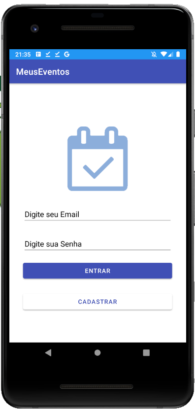
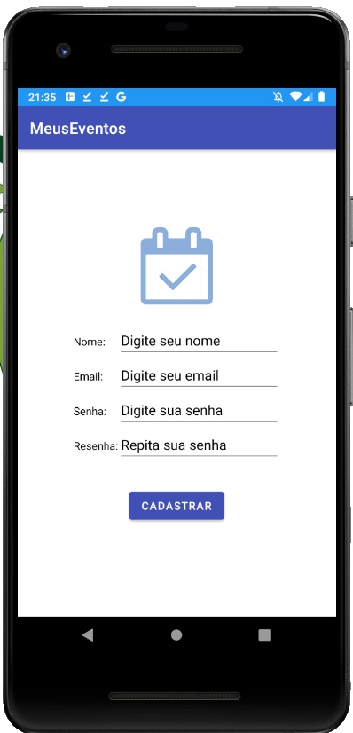
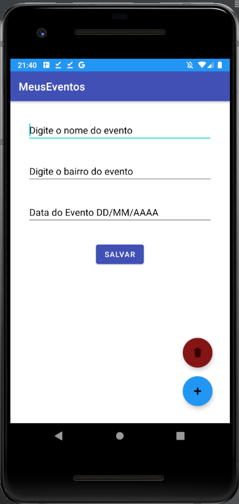
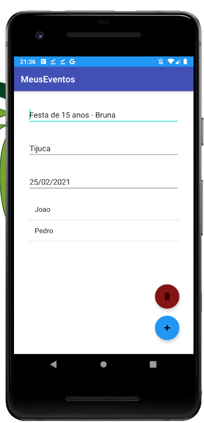
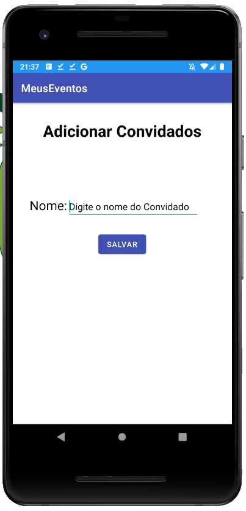
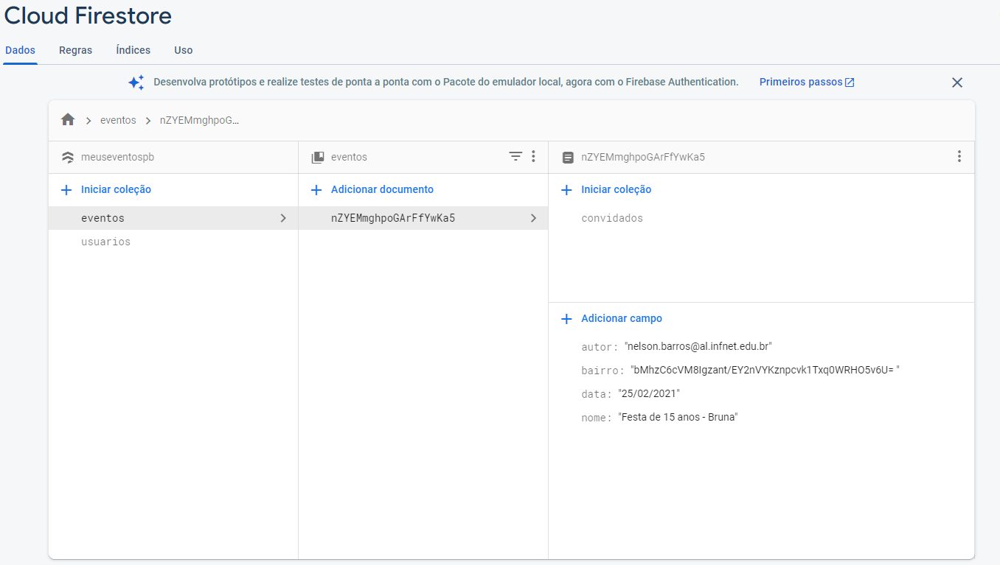

# MeusEventos

Projeto Final das Materias de Segurança, Monetização e Publicação de Aplicativos Android e Projeto de Bloco - Desenvolvimento Android

utilizando login autenticado no firebase, utilização do fireStore criptografando 1 campo e admob

